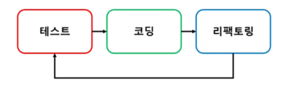

## TDD 시연 강의
> [코드 바로가기](../../src/test/java/study/TDD/exercise/PasswordMeterTest.java)

### 테스트 주도 개발 (Test-Driven Development)
- 테스트로부터 시작하는 개발 방식
- 진행 순서
  1. (실패하는) 테스트 코드 작성
  2. 테스트를 통과시킬 만큼 구현
  3. 코드 정리(리팩토링)
<p align="center"></p>

### Eexercise
> <시연 문제> 암호 검사기
> - 다음 규칙에 따라 암호를 검사한다. 
>   - 세 가지 규칙 중 1개의 규칙을 충족하면 STRONG, 
>   - 2개의 규칙을 충족하면 NORMAL, 
>   - 1개 이하의 규칙을 충족하면 WEAK 에 해당한다.
>   ```
>   [규칙]
>   1. 길이가 8글자 이상
>   2. 0부터 9 사이의 숫자를 포함
>   3. 대문자 포함
>   ```


### TDD 진행과 장점
1. 테스트가 개발을 주도한다.
2. 지속적으로 코드를 정리하여 개발 과정에서 리팩토링을 진행한다.
3. 빠른 피드백이 가능하기 때문에 내가 만든 코드가 올바른지 바로 알 수 있다.</br>
   (ex) 코드 수정 -> 다른 코드가 깨지네? ➡ 바로 원인을 찾고 해결할 수 있다.
4. 테스트를 통과할 만큼만 코드 작성한다. </br>
   ➡ 필요하지 않은 코드를 미리 작성하지않게 된다.</br>
   ➡ 불필요한 코드가 사라진다.</br>
   ➡ 기능 구현하는데 필요한 만큼의 코드를 만들게 된다.
5. 테스트할 대상 이름, 기능 이름, 결과 타입 등 일부 설계를 함께 진행하게 된다.
