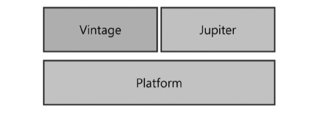

# TDD와 JUnit

## TDD란?
- 테스트 주도 개발
- 테스트를 먼저 설계 및 구축 후 테스트를 통과할 수 있는 코드를 짜는 것
- 애자일 개발 방식 중 하나
  - 코드 설계시 원하는 단계적 목표에 대해 설정하여 진행하고자 하는 것에 대한 결정 방향의 갭을 줄이고자 함
  - 최초 목표에 맞춘 테스트를 구축하여 그에 맞게 코드를 설계하기 때문에 보다 적은 의견 충돌을 기대할 수 있음
    (방향 일치로 인한 피드백과 진행 방향의 충돌 방지)

### 테스트 코드의 작성 목적
- 코드의 안정성을 높일 수 있음
- 기능을 추가하거나 변경하는 과정에서 발생할 수 있는 Side-Effect를 줄일 수 있음
  - ex) 현재 코드 변경으로 인해 이전에 구현했던 기능에 문제가 생기는지 확인할 수 있다.
- 해당 코드가 작성된 목적을 명확하게 표현할 수 있음
  - 코드에 불필요한 내용이 들어가는 것을 비교적 줄일 수 있음
---
## JUnit이란?
- Java 진영의 대표적인 Test Framework
- 단위 테스트(Unit Test)를 위한 도구를 제공
- 어노테이션(Annotation)을 기반으로 테스트를 지원
- 단정문(Assert)으로 테스트 케이스의 기대갑셍 대해 수행 결과를 확인할 수 있다.
- Spring Boot 2.0버전부터 JUnit5 버전을 사용
- JUnit5는 크게 Jupiter, Platform, Vintage 모듈로 구성됨
        
## JUnit 모듈

### JUnit Platform
- Test를 실행하기 위한 뼈대
- Test를 발견하고 테스트 계획을 생성하는 TestEngine 인터페이스를 가지고 있음
- TestEngine을 통해 Test를 발견하고, 수행 및 결과를 보고함
- 각종 IDE 연동을 보조하는 역할을 수행 (콘솔 출력 등)
- (Platform = TestEnginAPI + Console Launcher + JUnit4Based Runner)

### JUnit Jupiter
- TestEngin API 구현체로 JUnit5를 구현하고 있음
- 테스트의 실제 구현체는 별도 모듈 역할을 수행하는데, 그 모듈 중 하나가 Jupiter-Engine임
- 이 모듈은 Jupiter-API를 사용하여 작성한 테스트 코드를 발견하고 실행하는 역할을 수행
- 개발자가 테스트 코드를 작성할 때 사용됨

### JUnit Vintage
- TestEngine API 구현체로 JUnit 3,4를 구현하고 있음
- 기존 JUnit 3,4 버전으로 작성된 테스트 코드를 실행할 때 사용됨
- Vintage-Engine 모듈을 포함하고 있음

## 통합테스트와 단위테스트

### 통합테스트
- 여러 기능을 조합하여 전체 비지니스 로직이 제대로 동작하는지 확인하는 것을 의미
- 통합 테스트의 경우 @SpringBootTest를 사용하여 진행
- 이 방법을 대규모 프로젝트에서 사용할 경우, 테스트를 실행할 때마다 모든 빈을 스캔하고 로드하는 작업이 반복되어 매번 무거운 작업을 수행해야 한다. 

### 단위테스트
- 프로젝트에 필요한 모든 기능에 대한 테스트를 각각 진행하는 것을 의미
- 코드의 특정 모듈이 의도된 대로 동작하는지 테스트하는 절차를 의미
- 모든 함수와 메소드에 대한 각각의 테스트 케이스(Test Case)를 작성하는 것
- 일반적으로 스프링 부트에서는 `org.springframework.boot:spring-boot-starter-test` 디펜던시만으로 의존성을 모두 가질 수 있음

> + F.I.R.S.T 원칙
>   + Fast : 테스트 코드의 실행은 빠르게 진행되어야 함
>   + Independent : 독립적인 테스트가 가능해야 함
>   + Repeatable : 테스트는 매번 같은 결과를 만들어야 함
>   + Self-Validating: 테스트는 그 자체로 실행하여 결과를 확인할 수 있어야 함
>   + Timely : 단위 테스트는 비지니스 코드가 완성되기 전에 구성하고 테스트가 가능해야 함
>               (코드가 완성되기 전부터 테스트가 따라와야 한다는 TDD의 원칙을 담고 있음)

## JUnit LifeCycle Annotation
> Junit5는 아래와 같은 테스트 라이프 사이클을 가지고 있다.

| Annotation | Description                                         |
|------------|:----------------------------------------------------|
| @Test      | 테스트용 메소드를 표현하는 어노테이션                                |
| @BeforEach | 각 테스트 메소드가 시작되기 전에 실행되어야 하는 메소드를 표현                 |
| @AfterEach | 각 테스트 메소드가 시작된 후 실행되어야 하는 메소드를 표현                   |
| @BeforeAll | 테스트 시작 전에 실행되어야 하는 메소드를 표현 (static 처리가 필요한 메소드에 사용) |
| @AfterAll  | 테스트 종료 후에 실행되어야 하는 메소드를 표현 (static 처리가 필요한 메소드에 사용) |
----
## Main Annotation

### SpringBootTest (SpringBoot 제공)
- 통합 테스트 용도로 사용됨
- @SpringBootApplication을 찾아가 하위의 모든 Bean을 스캔하여 로드함
- 그 후 Test용 Application Context를 만들어 Bean을 추가하고, MockBean을 찾아 교체
  - Aplication 클래스를 찾아가 로드를 해서 모든 Bean이 로드될 수 있게 해준다.

### @ExtendWith(JUnit4)
- Junit4에서 @RunWith로 사용되던 어노테이션이 ExtendWith로 변경됨
- @ExtendWith는 메인으로 실행될 Class를 지정할 수 있음
- @SpringBootTest는 기본적으로 @ExtendWith가 추가되어 있음

